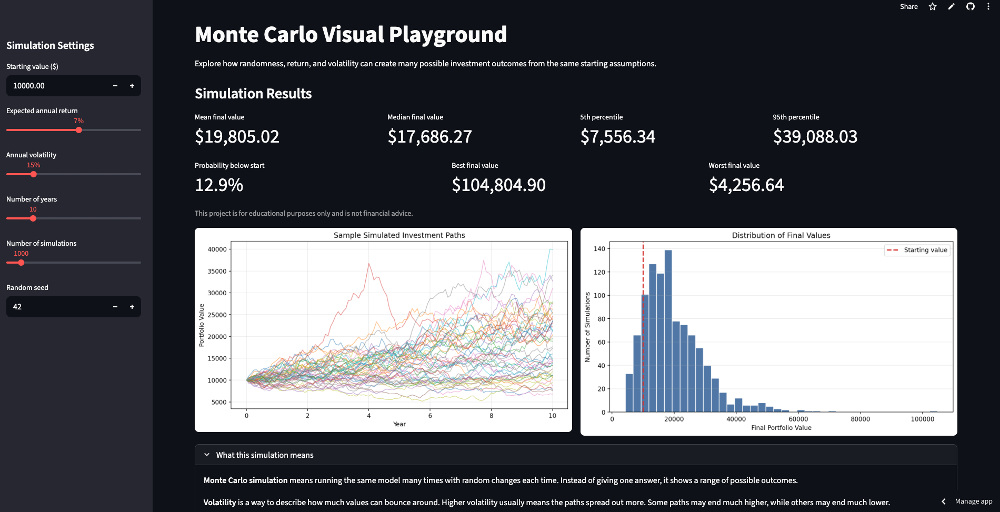

# Monte Carlo Visual Playground

Live App: https://monte-carlo-visual-playground.streamlit.app

A beginner-focused Python/Streamlit app for exploring how randomness and volatility affect long-term outcomes using Monte Carlo simulation.

This project is built as a learning tool to understand uncertainty, not to predict real markets.

---

## What This Project Does

This app simulates many possible future paths for an investment based on a single set of assumptions.

Instead of producing one “prediction,” it shows a **range of possible outcomes**, helping visualize risk and variability.

You can control:

* Starting value
* Expected annual return
* Volatility
* Time horizon
* Number of simulations
* Random seed

---

## Why This Matters

Most people think in single outcomes:

> “The market will return 7%”

This project shows why that thinking is flawed.

Even with the same assumptions:

* outcomes vary widely
* extreme scenarios occur
* averages hide risk

This is the core idea behind probabilistic thinking and quantitative modeling.

---

## Features

* Interactive Streamlit controls
* Monte Carlo simulation using monthly steps
* Sample path visualization (line chart)
* Distribution of final outcomes (histogram)
* Summary statistics:

  * mean, median
  * percentiles (5th, 95th)
  * probability of loss
* Plain-English explanations of key concepts

---

## Screenshot



---

## How It Works (Simple Explanation)

Each simulation represents one possible future.

At each step:

* a random return is generated
* based on expected return and volatility
* the value is updated

This repeats over time.

Running many simulations creates a distribution of outcomes.

Key idea:

> Same assumptions ≠ same results

---

## Technical Details

* Model: simplified geometric Brownian motion
* Time step: monthly
* Volatility scaling: annual volatility ÷ √12
* Compounding: cumulative product of returns

---

## Limitations

* Not a real market model
* Assumes normally distributed returns
* Ignores:

  * fees
  * taxes
  * inflation
  * changing conditions
* Sensitive to input assumptions

This is a conceptual tool, not a financial model.

---

## What I Learned

* How to structure a small Python project
* How Monte Carlo simulation works in practice
* How volatility impacts outcomes
* How to deploy a Streamlit app publicly

---

## Running Locally

```bash
python3 -m venv .venv
source .venv/bin/activate
pip install -r requirements.txt
streamlit run app.py
```

---

## Deployment

Deployed using Streamlit Community Cloud directly from GitHub.

---

## Future Improvements

* Add drawdown calculations
* Add rolling volatility
* Support contributions/withdrawals
* Export simulation data
* Compare multiple strategies

---

## Disclaimer

This project is for educational purposes only and is not financial advice.
